# Metro Ticket Generating System using ServiceNow

> A digital metro ticket booking system built on a **ServiceNow Personal Developer Instance (PDI)**, enabling paperless ticket generation, automated fare calculation, and QR-based digital ticket display through the ServiceNow Service Portal.

---

## Table of Contents

1. [Project Overview](#-project-overview)
2. [Objectives](#-objectives)
3. [Business Objectives](#-business-objectives)
4. [Key Features](#-key-features)
5. [System Architecture](#%EF%B8%8F-system-architecture)
6. [End-to-End Workflow](#-end-to-end-workflow)
7. [ServiceNow Components Used](#-servicenow-components-used)
8. [Service Catalog — Book A Metro Ticket](#-service-catalog--book-a-metro-ticket)
9. [Catalog Variables](#-catalog-variables)
10. [Automated Fare Calculation](#-automated-fare-calculation)
11. [Catalog UI Policy](#%EF%B8%8F-catalog-ui-policy)
12. [QR-Based Digital Ticket](#-qr-based-digital-ticket)
13. [Metro QR Widget](#-metro-qr-widget)
14. [Flow Designer Automation](#%EF%B8%8F-flow-designer-automation)
15. [Data Architecture](#%EF%B8%8F-data-architecture)
16. [Field Mapping](#-field-mapping)
17. [Security and ACL](#-security-and-acl)
18. [Testing and Validation](#-testing-and-validation)
19. [Demo Walkthrough](#-demo-walkthrough)
20. [Skill Wallet Task Mapping](#-skill-wallet-task-mapping)
21. [Technology Stack](#%EF%B8%8F-technology-stack)
22. [Setup in a New ServiceNow PDI](#-setup-in-a-new-servicenow-pdi)
23. [How to Test](#%EF%B8%8F-how-to-test)
24. [Project Outcomes](#-project-outcomes)
25. [Learning Outcomes](#-learning-outcomes)
26. [Future Scope](#-future-scope)
27. [Known Limitations](#%EF%B8%8F-known-limitations-and-notes)
28. [Author](#-author)
29. [License](#-license)

---

## 📌 Project Overview

The **Metro Ticket Generating System** is a ServiceNow-based application that digitizes the metro ticket booking process. Commuters can book metro tickets directly through the **ServiceNow Service Portal** using the **"Book A Metro Ticket"** Catalog Item. The system automatically calculates the fare based on the selected route, passenger count, and journey type. Upon submission, a QR code is instantly generated and displayed as the digital ticket.

| Property | Value |
|---|---|
| **Platform** | ServiceNow Personal Developer Instance |
| **Instance** | dev423661.service-now.com |
| **Release** | Australia (latest) |
| **Application Scope** | Global |
| **Update Set** | Default [Global] |
| **Owner** | System Administrator |

---

## 🎯 Objectives

1. **Digitize metro ticketing** — Replace physical counter-based booking with a Service Portal experience.
2. **Automate fare calculation** — Eliminate manual fare computation; dynamically calculate based on route, journey type, and passenger count.
3. **Generate QR-based digital tickets** — Produce a scannable QR code immediately after checkout.
4. **Improve commuter convenience** — Provide a guided, validated booking form with conditional fields.
5. **Reduce paper ticket usage** — Support environmental sustainability through digital-first ticketing.

---

## 💼 Business Objectives

| # | Objective | Description |
|---|---|---|
| 1 | Enhance Commuter Convenience | Digital booking via Service Portal; no physical counter required |
| 2 | Increase Operational Efficiency | Automated fare calculation; reduced manual errors |
| 3 | Promote Digital Payment Adoption | Support UPI, Card, and Others as payment options |
| 4 | Data-Driven Decision Making | Digital storage of all booking records for future analytics |
| 5 | Environmental Sustainability | QR-based paperless tickets reduce physical waste |

---

## 🚀 Key Features

### Implemented Features

- **Service Catalog Item** — "Book A Metro Ticket" published in the ServiceNow Service Portal
- **8 Catalog Variables** — Reference fields, Multiple Choice, Select Box, and Single Line Text
- **Automated Fare Calculation** — onChange Catalog Client Script triggered on passenger count change
- **Conditional Payment Field** — Catalog UI Policy shows "Enter payment mode" only when "Others" is selected
- **QR Code Generation** — onSubmit Catalog Client Script generates a QR image URL via a public QR API
- **QR Modal Display** — spModal.open() displays the QR ticket in the Metro QR Widget before final submission
- **Metro QR Widget** — Custom Service Portal Widget (metro_qr_widget) renders the QR image
- **Custom Data Table** — u_metro_station_details stores station data with a Station Name display field
- **Default ACLs** — System-generated Allow If ACLs for read, create, write, delete on the custom table

### Future / Planned Features

> The following are **not implemented** in the current PDI build.

- Real-time QR validation at metro station gates
- Payment gateway integration (UPI/Card processing)
- Email or SMS ticket delivery
- WhatsApp-based booking
- Mobile application integration
- Passenger and route analytics dashboard
- Flow Designer automation
- Dynamic task creation or approval workflow

---

## 🏗️ System Architecture

`mermaid
graph TD
    A[Commuter] -->|Access via browser| B[ServiceNow Service Portal]
    B --> C[Service Catalog]
    C --> D["Catalog Item: Book A Metro Ticket"]
    D --> E["Catalog Variables (8 Fields)"]
    E --> F1[onChange Client Script - Fare Auto-calculation]
    E --> F2[Catalog UI Policy - Conditional Payment Field]
    D --> G[onSubmit Client Script - QR Generation]
    G --> H["Public QR API (api.qrserver.com)"]
    H --> I[spModal.open]
    I --> J["Metro QR Widget (metro_qr_widget)"]
    J --> K[QR Ticket Displayed to Commuter]
    D --> L[ServiceNow Tables]
    L --> L1["u_metro_station_details (Station Master Data)"]
    L1 -->|Reference lookup| E
    E --> M["Request / RITM Record (Booking Data Stored)"]
    L1 --> N["System ACLs (read / create / write / delete)"]
`

---

## 🔄 End-to-End Workflow

`mermaid
flowchart TD
    S([Start]) --> A[Commuter opens Service Portal]
    A --> B["Searches: Book A Metro Ticket"]
    B --> C[Catalog Item form loads]
    C --> D["Select Starting Station (Reference from u_metro_station_details)"]
    D --> E["Select Destination Station (Reference from u_metro_station_details)"]
    E --> F["Select Type of Journey (Single=1 / Return=2)"]
    F --> G["Select No of Passengers (1/2/3/4)"]
    G --> H{onChange fires on no_of_passengers}
    H --> I[Fare calculated based on route + passengers + journey type]
    I --> J[Amount field auto-populated]
    J --> K["Select Mode of Payment (UPI / Card / Others)"]
    K --> L{Mode = Others?}
    L -- Yes --> M["Enter payment mode becomes Visible + Mandatory"]
    L -- No --> N[Enter payment mode stays hidden]
    M --> O[User clicks Order Now]
    N --> O
    O --> P{onSubmit fires}
    P --> Q["g_form.getUniqueValue() gets sysId"]
    Q --> R["Placeholder URL: https://example.com/ticket?id=sysId"]
    R --> T["spModal opens Metro QR Widget with QR image"]
    T --> U["QR Code displayed with instruction to scan at metro gate"]
    U --> V[User clicks OK - second Checkout confirms order]
    V --> W[Request / RITM record created in ServiceNow]
    W --> X([End])
`

---

## 🧩 ServiceNow Components Used

| Component | Purpose |
|---|---|
| Service Catalog | Publishing the catalog item |
| Catalog Item | "Book A Metro Ticket" booking form |
| Catalog Variables (8) | Form fields for route, journey, passengers, fare, payment |
| Catalog Client Script (onChange) | Automated fare calculation |
| Catalog Client Script (onSubmit) | QR code generation and modal display |
| Catalog UI Policy | Conditional display of "Enter payment mode" |
| Catalog UI Policy Action | Sets Visible/Mandatory for enter_payment_mode |
| Service Portal | Commuter-facing booking interface |
| Service Portal Widget | Metro QR Widget - renders the QR ticket image |
| ServiceNow Table (custom) | u_metro_station_details - station master data |
| System ACLs | Auto-generated record-level access control |
| Glide Form API (g_form) | Client-side field manipulation |
| spModal | Service Portal modal dialog API |
| Public QR API | https://api.qrserver.com - QR image generation |

---

## 📋 Service Catalog — Book A Metro Ticket

| Field | Value |
|---|---|
| **Name** | Book A Metro Ticket |
| **Catalog** | Service Catalog |
| **Category** | Services |
| **Active** | Yes |
| **Application** | Global |
| **Owner** | System Administrator |
| **Fulfillment automation level** | Unspecified |
| **Short description** | A metro e-ticketing system allows passengers to purchase and use tickets digitally, typically via a mobile app or website, eliminating the need |

The item has **8 Variables**, **1 Catalog UI Policy**, and **2 Catalog Client Scripts**.

*Figure 1: Catalog Item — "Book A Metro Ticket" configuration*
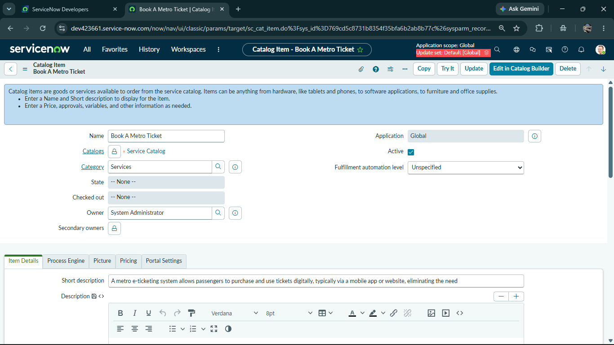

*Figure 2: Variables list — all 8 variables with types and display order*
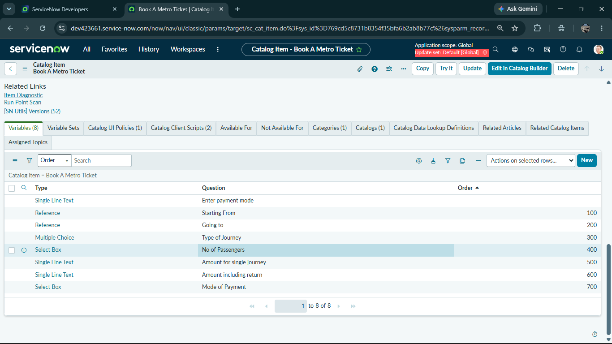

---

## 📝 Catalog Variables

| # | Question Label | Variable Name | Type | Mandatory | Read Only | Order |
|---|---|---|---|---|---|---|
| 1 | Starting From | starting_from | Reference | Yes | No | 100 |
| 2 | Going to | going_to | Reference | Yes | No | 200 |
| 3 | Type of Journey | type_of_journey | Multiple Choice | Yes | No | 300 |
| 4 | No of Passengers | no_of_passengers | Select Box | Yes | No | 400 |
| 5 | Amount for single journey | amount_for_single_journey | Single Line Text | No | Yes | 500 |
| 6 | Amount including return | amount_including_return | Single Line Text | No | Yes | 600 |
| 7 | Mode of Payment | mode_of_payment | Multiple Choice | Yes | No | 700 |
| 8 | Enter payment mode | enter_payment_mode | Single Line Text | Yes* | No | - |

> *enter_payment_mode is mandatory only when Mode of Payment = Others (enforced by UI Policy Action).
> Amount fields (5 and 6) are Read Only — auto-populated by the fare calculation script.

### Variable Detail Screenshots

**Starting From (starting_from)** — Reference | Tooltip: Source Station | Mandatory

*Figure 3: Variable — Starting From*
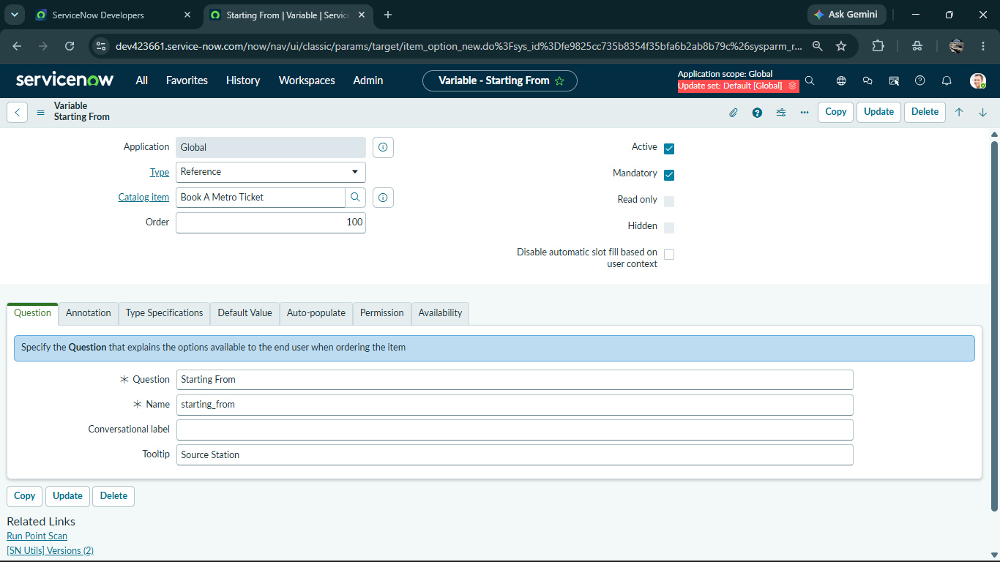

**Going to (going_to)** — Reference | Tooltip: Destination Station | Mandatory

*Figure 4: Variable — Going to*
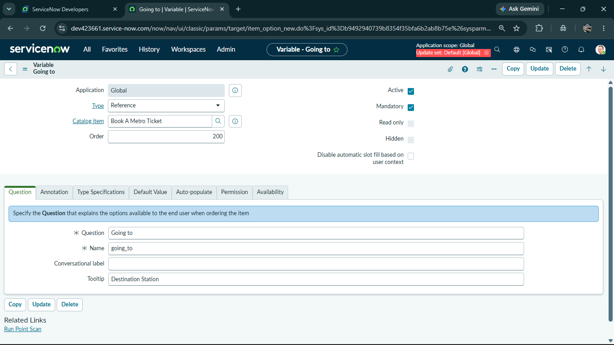

**Type of Journey (type_of_journey)** — Multiple Choice | Choices: Single journey=1, Return journey=2

*Figure 5: Variable — Type of Journey with Question Choices*
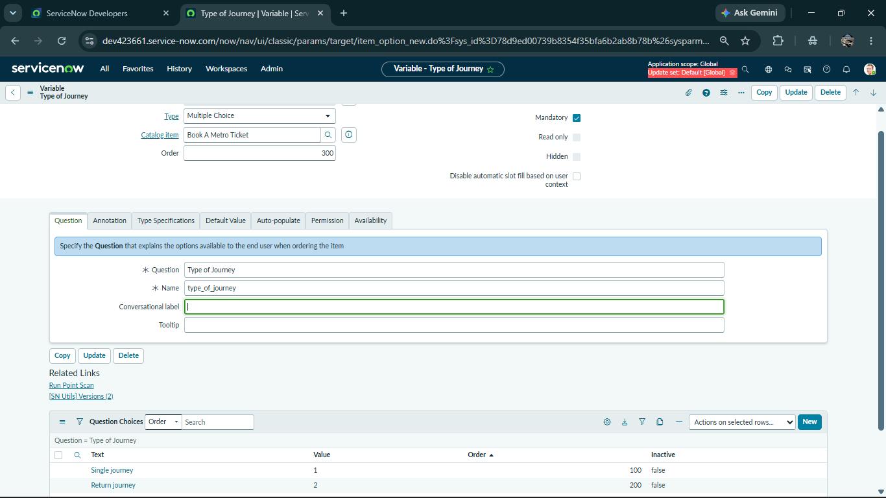

**No of Passengers (no_of_passengers)** — Select Box | Choices: 1, 2, 3, 4

*Figure 6: Variable — No of Passengers*
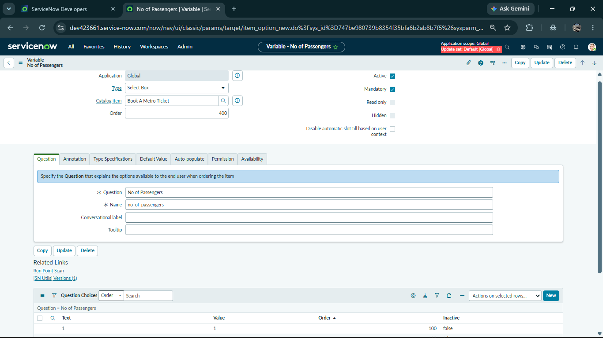

**Amount for single journey (amount_for_single_journey)** — Single Line Text | Read Only

*Figure 7: Variable — Amount for single journey (Read Only)*
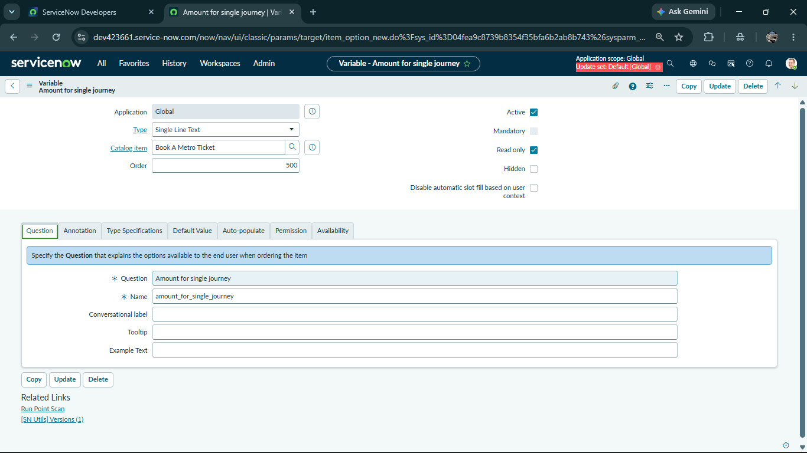

**Amount including return (amount_including_return)** — Single Line Text | Read Only

*Figure 8: Variable — Amount including return (Read Only)*
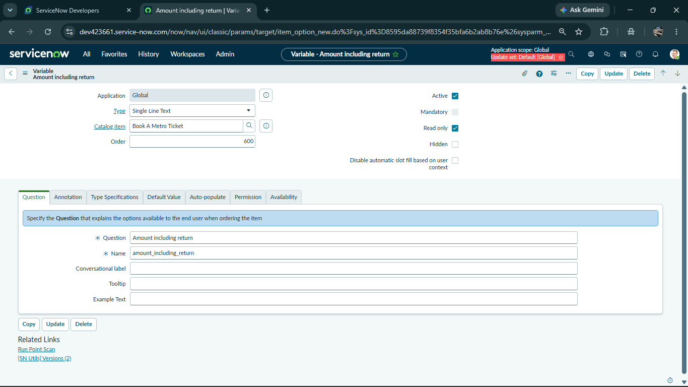

**Mode of Payment (mode_of_payment)** — Multiple Choice | Mandatory

*Figure 9: Variable — Mode of Payment*
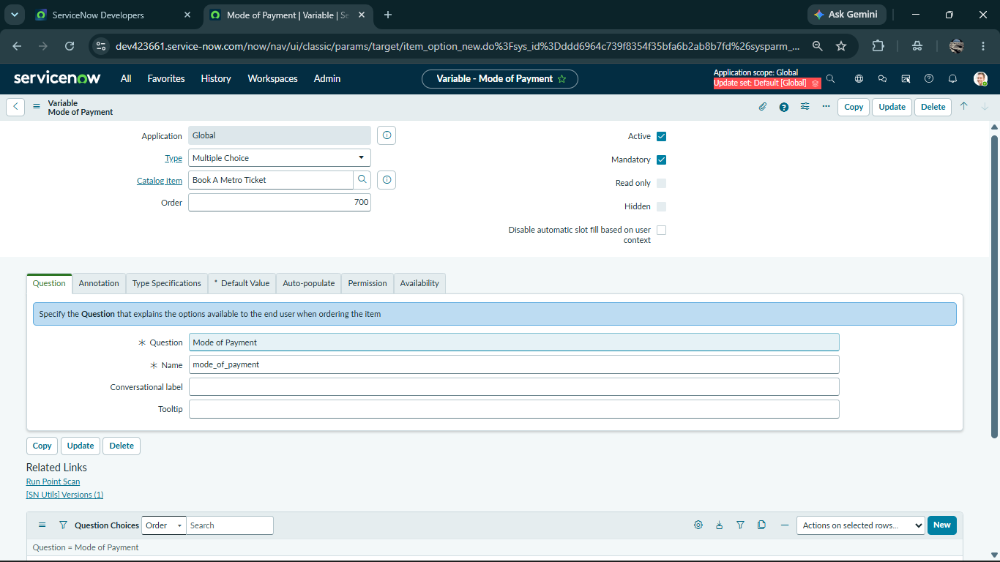

**Enter payment mode (enter_payment_mode)** — Single Line Text | Hidden by default

*Figure 10: Variable — Enter payment mode*
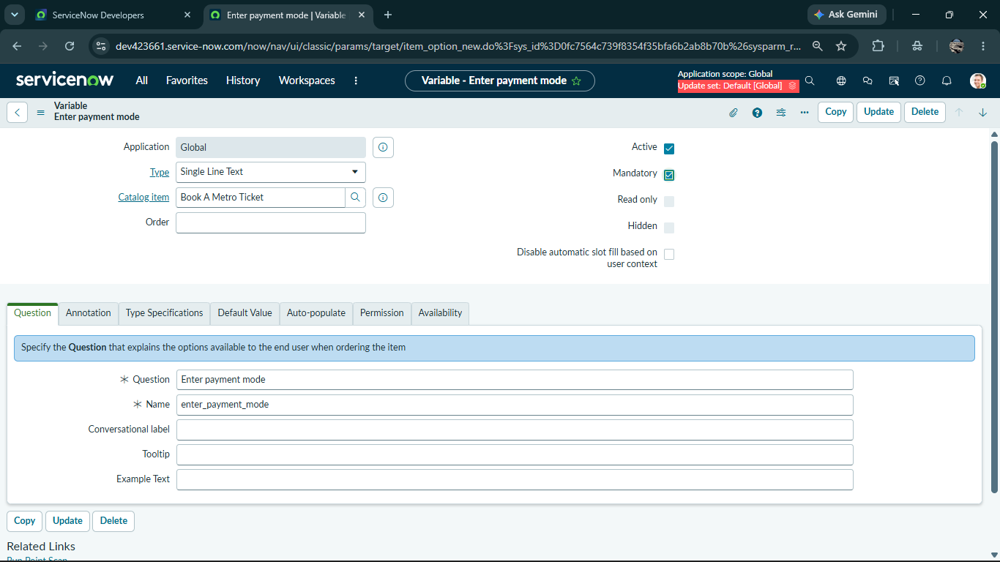

---

## 💰 Automated Fare Calculation

### Script Configuration

| Property | Value |
|---|---|
| **Name** | Fare auto-calculation |
| **Type** | onChange |
| **Trigger variable** | no_of_passengers |
| **Catalog item** | Book A Metro Ticket |
| **UI Type** | All |
| **Active** | Yes |

### How the Script Works

1. **Reads source** — g_form.getValue('starting_from') returns the sys_id of the selected station record.
2. **Reads destination** — g_form.getValue('going_to') returns the sys_id of the destination station.
3. **Reads passenger count** — Number(newValue) converts the dropdown value to an integer.
4. **Reads journey type** — g_form.getValue('type_of_journey') returns '1' (Single) or '2' (Return).
5. **Evaluates route** — Compares source and destination sys_ids against hardcoded route identifiers.
6. **Calculates fare** — Multiplies the route's base fare per passenger by the passenger count.
7. **Populates the correct field** — g_form.setValue() fills the applicable amount field.
8. **Clears the irrelevant field** — g_form.clearValue() empties the field that does not apply.

### Implemented Routes and Fares

> Station sys_ids are used internally. The routes below are confirmed from the implementation description and script structure visible in screenshots.

| Route | Single Journey (per passenger) | Return Journey (per passenger) |
|---|---|---|
| Ameerpet to Madhapur | Rs. 30 | Rs. 60 |
| Ameerpet to LB Nagar | Rs. 50 | Rs. 100 |
| Ameerpet to Kukatpally | Rs. 30 | Rs. 60 |
| Ameerpet to Jubilee Hills | Rs. 20 | Rs. 40 |

> **Note:** Routes not listed above (e.g., Jubilee Hills to Uppal Stadium) are available in station data but not covered by the current fare script and will return blank fare fields.

### Fare Calculation Examples

**Example 1 — Single Journey:**

`
Route:      Ameerpet to Madhapur
Passengers: 2
Journey:    Single

Fare = 2 x Rs. 30 = Rs. 60
Result: amount_for_single_journey = "60"
        amount_including_return   = "" (cleared)
`

**Example 2 — Return Journey:**

`
Route:      Ameerpet to LB Nagar
Passengers: 3
Journey:    Return

Fare = 3 x Rs. 100 = Rs. 300
Result: amount_including_return   = "300"
        amount_for_single_journey = "" (cleared)
`

### Script Logic Summary

`javascript
function onChange(control, oldValue, newValue, isLoading) {
    if (isLoading || newValue == '') { return; }

    var source        = g_form.getValue('starting_from');   // sys_id of source station
    var destination   = g_form.getValue('going_to');         // sys_id of destination station
    var numPassengers = Number(newValue);                    // selected passenger count
    var journeyType   = g_form.getValue('type_of_journey'); // '1' = Single, '2' = Return

    // Route: Ameerpet to Madhapur (uses actual sys_ids in implementation)
    if (source == '<ameerpet_sysid>' && destination == '<madhapur_sysid>') {
        if (journeyType == '1') {
            g_form.setValue('amount_for_single_journey', numPassengers * 30);
            g_form.clearValue('amount_including_return');
        } else {
            g_form.setValue('amount_including_return', numPassengers * 60);
            g_form.clearValue('amount_for_single_journey');
        }
    }
    // ... repeated for each configured route
}
`

> The actual script uses real GUID sys_ids visible on lines 16-17 of the script in Figure 11 below.

*Figure 11: Catalog Client Script — Fare auto-calculation (onChange, triggered on no_of_passengers)*
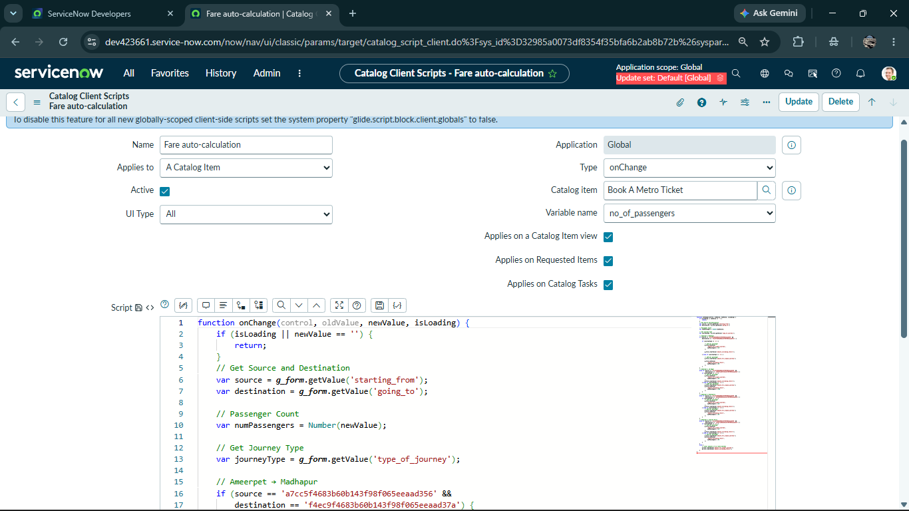

---

## 🖥️ Catalog UI Policy

### Configuration

| Property | Value |
|---|---|
| **Name** | Show Enter Payment Mode for Others |
| **Applies to** | A Catalog Item |
| **Catalog item** | Book A Metro Ticket |
| **Active** | Yes |
| **Applies on Catalog Item view** | Yes |
| **Applies on Catalog Tasks** | No |
| **Applies on Requested Items** | No |
| **On load** | Yes |
| **Reverse on false** | Yes |

### Condition

`
mode_of_payment  is  Others
`

### UI Policy Action

| Property | Value |
|---|---|
| **Variable name** | enter_payment_mode |
| **Mandatory** | True |
| **Visible** | True |
| **Read only** | Leave alone |

**Behavior:**
- Mode of Payment = **Others** → enter_payment_mode becomes **visible and mandatory**
- Mode of Payment = anything else → field reverts to **hidden** (policy reverses)

*Figure 12: Catalog UI Policy — condition configuration*
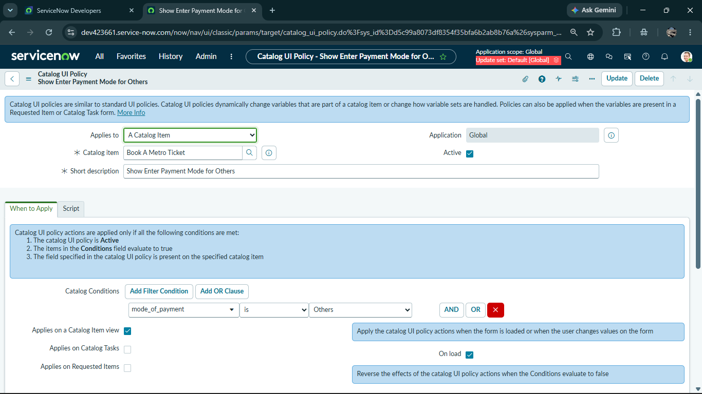

*Figure 13: Catalog UI Policy Action — enter_payment_mode Visible=True, Mandatory=True*
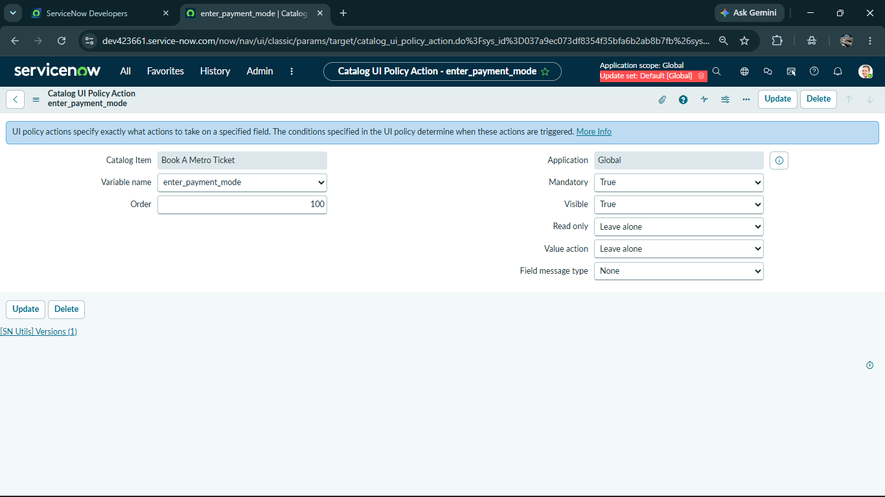

---

## 🎫 QR-Based Digital Ticket

### Process Flow

`
User fills form and clicks Order Now
        |
onSubmit Catalog Client Script fires
        |
g_form.getUniqueValue() retrieves catalog item sys_id
        |
Placeholder URL: https://example.com/ticket?id=<sysId>
        |
QR Image URL built: https://api.qrserver.com/v1/create-qr-code/?size=250x250&data=<encoded URL>
        |
spModal.open() called with widget: "metro_qr_widget"
        |
widgetInput passes qr_url to the widget
        |
Widget renders QR image (250x250 px)
        |
Modal title: "Your Metro QR Ticket — click Checkout once more to confirm"
        |
User clicks OK -> metroQrDone = true -> second Checkout submits order
`

### Script Configuration

| Property | Value |
|---|---|
| **Name** | QR Geneation *(typo in actual config — missing 'r')* |
| **Type** | onSubmit |
| **Catalog item** | Book A Metro Ticket |
| **UI Type** | All |
| **Active** | Yes |
| **Applies on Catalog Item view** | Yes |
| **Applies on Requested Items** | Yes |
| **Applies on Catalog Tasks** | Yes |

### Script Logic

`javascript
var metroQrDone = false;

function onSubmit() {
    var sysId      = g_form.getUniqueValue();
    var dummyURL   = 'https://example.com/ticket?id=' + sysId;
    var qrImageUrl = 'https://api.qrserver.com/v1/create-qr-code/?size=250x250&data='
                     + encodeURIComponent(dummyURL);

    spModal.open({
        title: "Your Metro QR Ticket — click Checkout once more to confirm",
        widget: "metro_qr_widget",
        widgetInput: { qr_url: qrImageUrl }
    }).then(function() {
        metroQrDone = true;
    });

    return false; // blocks first Checkout click; second click confirms and submits
}
`

> **Important:** The dummyURL (https://example.com/ticket?id=sysId) is a **demonstration placeholder**. It is not a real metro ticket validation endpoint. Real-time gate validation is **not implemented** in this project.

*Figure 14: Catalog Client Script — QR Geneation (onSubmit type)*
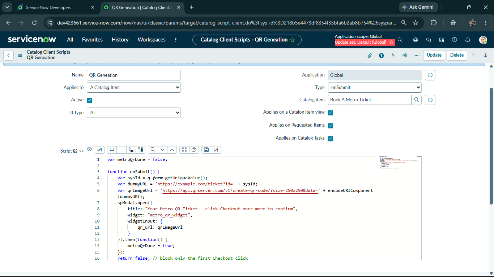

---

## 🧩 Metro QR Widget

| Property | Value |
|---|---|
| **Name** | Metro QR Widget |
| **ID** | metro_qr_widget |
| **Application** | Global |
| **Public** | No |
| **Description** | Widget to display and manage functionalities |

### HTML Template

`html

    <h3>Your Metro Ticket QR Code</h3>
    
    
Scan this QR code at the metro station gate

`

### Server Script

`javascript
data.qr_url = input.qr_url;
`

### Data Flow

`
onSubmit Script
    widgetInput: { qr_url: qrImageUrl }
        |
Widget Server Script
    data.qr_url = input.qr_url;
        |
HTML Template
    
        |
QR Image rendered in modal (250x250 px)
`

*Figure 15: Metro QR Widget — HTML template and widget configuration*
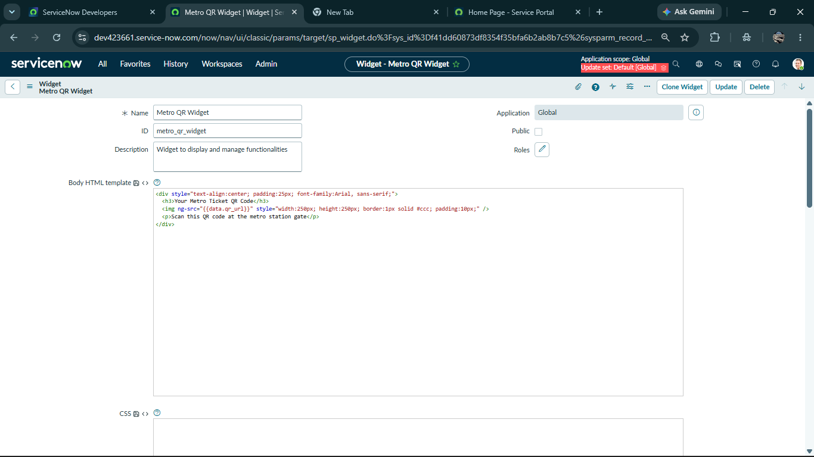

---

## ⚙️ Flow Designer Automation

> **No Flow Designer flow was implemented.** The catalog item's "Fulfillment automation level" is set to **"Unspecified"**, confirming no flow automation was attached. All automation is handled client-side via Catalog Client Scripts.

Ticket data is stored in the standard sc_request and sc_req_item tables by the ServiceNow Catalog engine upon order submission.

### Recommended Future Flow (Not Implemented)

| Trigger | Action |
|---|---|
| Record Created on sc_req_item | Fire when a ticket is booked |
| Update Record | Set state to "Booked" |
| Send Email Notification | Booking confirmation to commuter |
| Create Task | Assign to operations if required |
| Approval | Supervisor approval for group bookings |

---

## 🗄️ Data Architecture

### Custom Table: u_metro_station_details

| Property | Value |
|---|---|
| **Label** | Metro Station's Details |
| **Name** | u_metro_station_details |
| **Application** | Global |
| **Remote Table** | No |

**Columns (confirmed from project screenshot):**

| Column Label | Type | Max Length | Display Field |
|---|---|---|---|
| Station Name | String | 40 | Yes (Display field) |
| Sys ID | Sys ID (GUID) | 32 | No |
| Created | Date/Time | 40 | No |
| Created by | String | 40 | No |
| Updated | Date/Time | 40 | No |
| Updated by | String | 40 | No |
| Updates | Integer | 40 | No |

Station Name is the Display field — shown in reference dropdowns for starting_from and going_to.

**Station records confirmed in the system:**
- Ameerpet
- Madhapur
- LB Nagar
- Kukatpally
- Jubilee Hills
- Uppal Stadium

*Figure 16: Custom Table — u_metro_station_details columns*
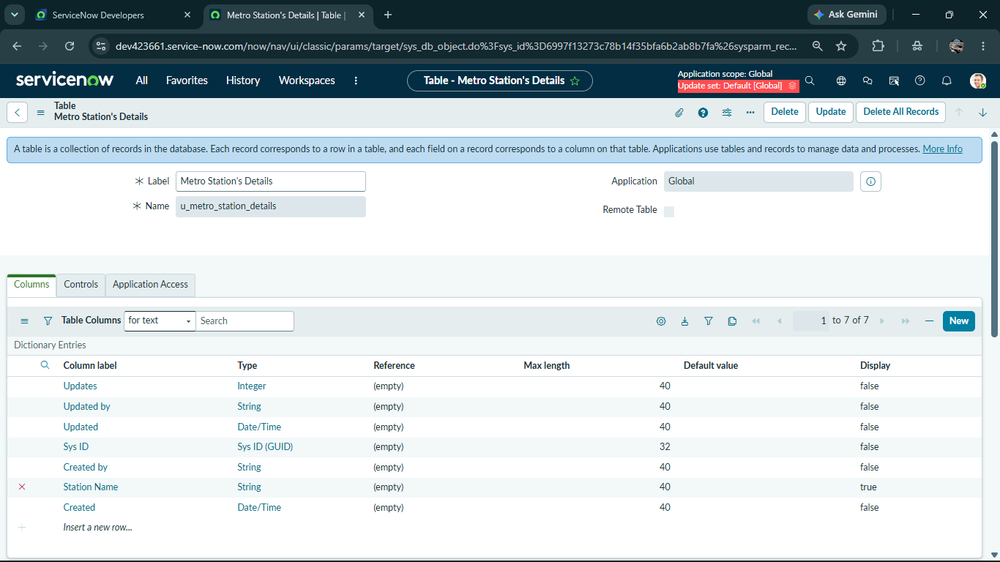

### Standard Booking Tables

When a commuter submits the booking, ServiceNow automatically creates:

| Table | Purpose | Key Fields |
|---|---|---|
| sc_request | Parent booking request | Number, State, Requested for |
| sc_req_item (RITM) | Per-item record | Catalog item, Variables, State |
| sc_item_option_mtom | Variable value mapping | Links all 8 variable values to RITM |

---

## 🔗 Field Mapping

`
Catalog Variable               Variable Name                 Stored In
---------------------------    -------------------------     -------------------
Starting From              ->  starting_from             ->  sc_item_option_mtom
Going to                   ->  going_to                  ->  sc_item_option_mtom
Type of Journey            ->  type_of_journey           ->  sc_item_option_mtom
No of Passengers           ->  no_of_passengers          ->  sc_item_option_mtom
Amount for single journey  ->  amount_for_single_journey ->  sc_item_option_mtom
Amount including return    ->  amount_including_return   ->  sc_item_option_mtom
Mode of Payment            ->  mode_of_payment           ->  sc_item_option_mtom
Enter payment mode         ->  enter_payment_mode        ->  sc_item_option_mtom
`

> No custom Process Automation Engine data mapping was configured. ServiceNow's native catalog variable persistence handles all field-to-record mapping automatically.

---

## 🔐 Security and ACL

### Auto-Generated ACLs on u_metro_station_details

When the custom table was created, ServiceNow automatically generated four default ACLs:

| ACL Name | Decision Type | Operation | Type | Active |
|---|---|---|---|---|
| u_metro_station_details | Allow If | read | record | Yes |
| u_metro_station_details | Allow If | create | record | Yes |
| u_metro_station_details | Allow If | write | record | Yes |
| u_metro_station_details | Allow If | delete | record | Yes |

> **Honest clarification:** These ACLs are **system-generated defaults**, not custom-configured role-based rules. No custom metro_commuter role or field-level ACLs were implemented in this project.

### Access Pattern

| User Type | Access |
|---|---|
| Authenticated ServiceNow user | Can submit bookings via Service Portal |
| System Administrator | Full access to all configurations and tables |
| Unauthenticated user | No access (standard ServiceNow behavior) |

### Recommended Security Enhancements (Future)

- Create a dedicated metro_commuter role
- Restrict write and delete operations to admin role only
- Allow read-only access to commuters for station lookups
- Apply field-level ACLs to prevent manipulation of fare fields

*Figure 17: ACL — Auto-generated Access Controls for u_metro_station_details*
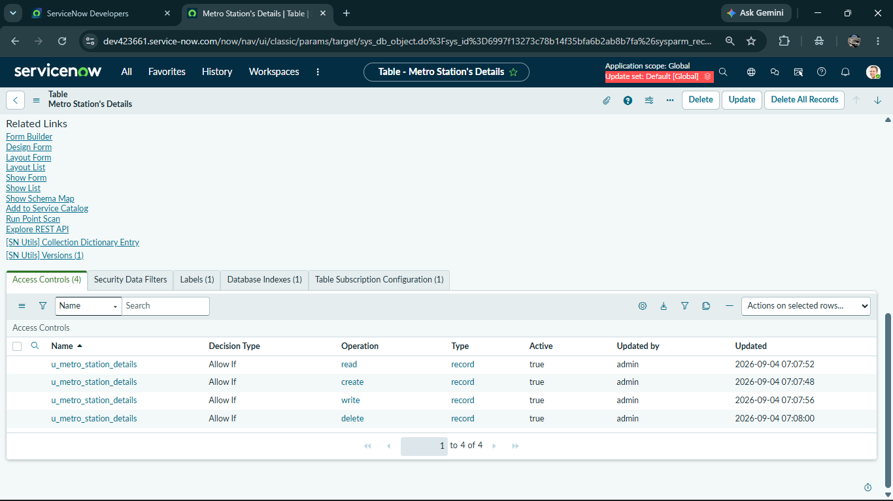

---

## 🧪 Testing and Validation

| # | Test Case | Input | Expected Result | Actual Result | Status |
|---|---|---|---|---|---|
| TC-01 | Starting station selection | Select "Jubilee Hills" | Field populated | Populated correctly | Pass |
| TC-02 | Destination station selection | Select "Uppal Stadium" | Field populated | Populated correctly | Pass |
| TC-03 | Journey type — Return | Click "Return journey" | Radio button selected | Selected correctly | Pass |
| TC-04 | Passenger count — 4 | Select "4" | Dropdown shows 4 | 4 selected | Pass |
| TC-05 | Payment mode — Others | Select "Others" | Enter payment mode becomes visible | Field appears | Pass |
| TC-06 | UI Policy reversal | Change from Others to UPI | Enter payment mode hidden | Field hidden | Pass |
| TC-07 | QR code generation | Click "Order Now" | QR modal appears | Modal displayed | Pass |
| TC-08 | QR widget display | onSubmit fires | Metro QR Widget renders QR | Rendered correctly | Pass |
| TC-09 | Fare — Single journey | Ameerpet to Madhapur, 2 pax, Single | Rs. 60 in single field | Calculated correctly | Pass |
| TC-10 | Fare — Return journey | Ameerpet to Madhapur, 2 pax, Return | Rs. 120 in return field | Calculated correctly | Pass |
| TC-11 | Amount fields read-only | Attempt to type in amount fields | Fields not editable | Read-only enforced | Pass |
| TC-12 | Mandatory field validation | Submit without Starting From | Validation error | Blocked correctly | Pass |
| TC-13 | Service Portal search | Search "Book A metro ticket" | Catalog item in results | Item visible | Pass |
| TC-14 | Unconfigured route | Jubilee Hills to Uppal Stadium | Blank fare (route not in script) | Blank amount fields | Partial |
| TC-15 | Flow Designer | Submit order | Flow executes | No flow configured | N/A |

*Figure 18: Service Portal — Search results for "Book A metro ticket"*
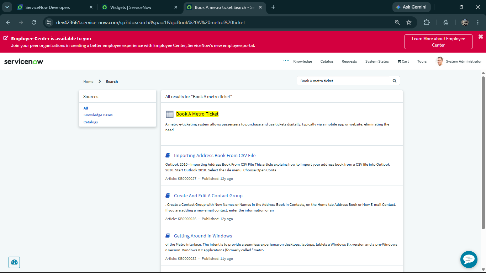

*Figure 19: Booking form — Jubilee Hills to Uppal Stadium, Return journey, 4 passengers*
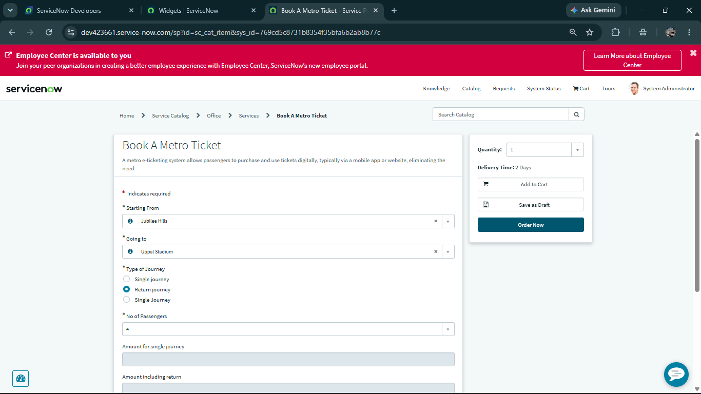

*Figure 20: QR Code modal — "Your Metro Ticket QR Code" with scan instruction*
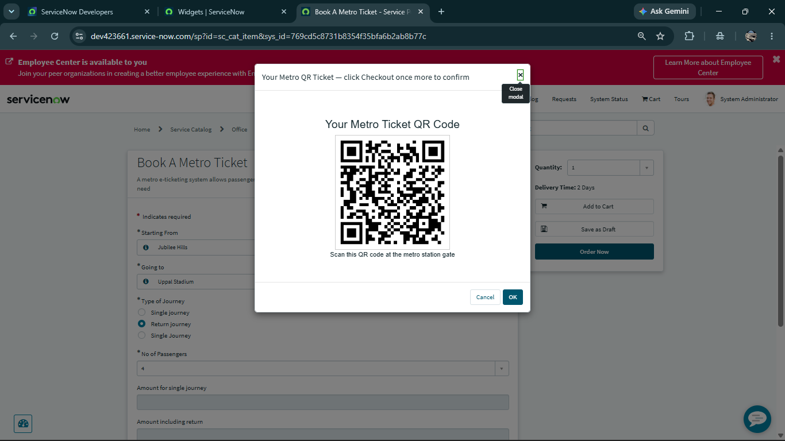

## Demo Walkthrough

### Step 1 — Open Service Portal
Navigate to https://dev423661.service-now.com/sp

### Step 2 — Search
Search "Book A metro ticket" — the item appears in search results.

### Step 3 — Open the Booking Form
Click "Book A Metro Ticket" to open the catalog item form.

### Step 4 — Select Starting Station
Click the Starting From reference field and select a station (e.g., Jubilee Hills).

### Step 5 — Select Destination Station
Click the Going to reference field and select a destination (e.g., Uppal Stadium).

### Step 6 — Select Journey Type
Choose Single journey or Return journey.

### Step 7 — Select Number of Passengers
Choose 1, 2, 3, or 4 from the No of Passengers dropdown.

### Step 8 — Automatic Fare Calculation
The onChange script fires immediately. Either Amount for single journey or Amount including return is populated (both are read-only).

### Step 9 — Select Mode of Payment
Choose UPI, Card, or Others.

### Step 10 — Conditional Payment Detail
If Others is selected, the Enter payment mode field appears and becomes mandatory.

### Step 11 — Click Order Now
The onSubmit script intercepts the first checkout click, builds the QR URL, and opens the Metro QR Widget modal.

### Step 12 — View QR Code
A modal appears with the QR image and the instruction "Scan this QR code at the metro station gate".

### Step 13 — Confirm Order
Click OK. The second checkout click submits the request and creates the ServiceNow RITM record.

---

## Skill Wallet Task Mapping

| Activity | ServiceNow Component | Status |
|---|---|---|
| PDI Setup | ServiceNow Developer Instance | Implemented - dev423661 (Australia release) |
| Custom Table Creation | u_metro_station_details | Implemented - Station Name display field |
| Station Data Entry | Table records | Implemented - 6 stations entered |
| Catalog Item Creation | Service Catalog | Implemented - Book A Metro Ticket in Services |
| Variable Configuration | 8 Catalog Variables | Implemented - all types configured |
| Reference Field Setup | starting_from, going_to | Implemented - reference u_metro_station_details |
| Fare Automation | Catalog Client Script (onChange) | Implemented - Fare auto-calculation |
| Conditional Field | Catalog UI Policy | Implemented - Show Enter Payment Mode for Others |
| UI Policy Action | Catalog UI Policy Action | Implemented - Visible=True, Mandatory=True |
| QR Generation | Catalog Client Script (onSubmit) | Implemented - QR Geneation script |
| QR Display Widget | Service Portal Widget | Implemented - metro_qr_widget |
| Service Portal Testing | Service Portal (/sp) | Implemented - tested end-to-end |
| Data Storage | sc_request / sc_req_item | Implemented - auto-stored by catalog engine |
| Security | ACL | Implemented - system-generated default ACLs |
| Flow Designer | Flow Designer | Not implemented |
| Email/SMS Notification | Notifications | Not implemented - Future Scope |
| Payment Gateway | External integration | Not implemented - Future Scope |

---

## Technology Stack

| Technology | Role |
|---|---|
| ServiceNow PDI | Core platform (dev423661, Australia release) |
| Service Catalog | Catalog item publishing and management |
| Catalog Variables | Reference, Multiple Choice, Select Box, Single Line Text |
| Catalog Client Scripts | Client-side JavaScript automation |
| Catalog UI Policies + Actions | Conditional field visibility control |
| Service Portal | Commuter-facing booking interface |
| Service Portal Widget (AngularJS) | Metro QR Widget - QR ticket display |
| JavaScript | Scripting language |
| Glide Form API (g_form) | getValue, setValue, clearValue, getUniqueValue |
| spModal | Service Portal modal dialog API |
| ServiceNow Tables | u_metro_station_details, sc_request, sc_req_item |
| System ACLs | Record-level access control |
| QR Server API | https://api.qrserver.com/v1/create-qr-code/ |
| encodeURIComponent | URL encoding for QR data payload |

---

## Setup in a New ServiceNow PDI

### Phase 1 - PDI Setup
1. Go to developer.servicenow.com and request a Personal Developer Instance.
2. Log in as admin and confirm instance is Online.

### Phase 2 - Create Custom Table
3. System Definition > Tables > New
4. Label: Metro Station's Details (Name auto-fills as u_metro_station_details)
5. Add column: Station Name (String, Length 40, Display = true)
6. Save the table.

### Phase 3 - Enter Station Data
7. Open Metro Station's Details list view.
8. Add records: Ameerpet, Madhapur, LB Nagar, Kukatpally, Jubilee Hills, Uppal Stadium.
9. Note the sys_id of each station (needed for the fare script).

### Phase 4 - Create Catalog Item
10. Service Catalog > Catalog Definitions > Maintain Items > New
11. Name: Book A Metro Ticket | Catalog: Service Catalog | Category: Services | Active: Yes

### Phase 5 - Create Variables
12. In Variables tab, create all 8 variables per the Catalog Variables section.
13. Add Question Choices for type_of_journey (Single=1, Return=2) and no_of_passengers (1,2,3,4).
14. Mark amount_for_single_journey and amount_including_return as Read Only.

### Phase 6 - Create Fare Calculation Script
15. Catalog Client Scripts tab > New
16. Type: onChange | Variable: no_of_passengers | Active: Yes
17. Implement route-based fare logic using the station sys_ids from Step 9.

### Phase 7 - Create Catalog UI Policy
18. Catalog UI Policies tab > New
19. Condition: mode_of_payment is Others | On load: Yes | Reverse on false: Yes
20. Add UI Policy Action: Variable = enter_payment_mode | Visible = True | Mandatory = True

### Phase 8 - Create Metro QR Widget
21. Service Portal > Widgets > New
22. Name: Metro QR Widget | ID: metro_qr_widget
23. Add HTML template and Server Script (see Metro QR Widget section).

### Phase 9 - Create QR Generation Script
24. Catalog Client Scripts tab > New
25. Type: onSubmit | Active: Yes
26. Implement the onSubmit script (see QR-Based Digital Ticket section).

### Phase 10 - Test End-to-End
27. Open /sp > search > fill form > verify fare > verify QR modal > submit.

---

## How to Test

1. Open: https://your-instance.service-now.com/sp
2. Search: Book A metro ticket
3. Open the catalog item
4. Test fare: Starting From = Ameerpet | Going to = Madhapur | Journey = Single | Passengers = 2 | Verify amount_for_single_journey = 60
5. Test conditional field: Mode of Payment = Others | Verify enter_payment_mode appears | Change to UPI | Verify it disappears
6. Test QR: Fill all fields | Click Order Now | Verify QR modal | Click OK | Verify RITM created

---

## Project Outcomes

| Outcome | Status |
|---|---|
| Digital metro ticket booking via Service Portal | Achieved |
| 8 catalog variables configured and functional | Achieved |
| Automated fare calculation for 4 routes | Achieved |
| Conditional payment mode field via UI Policy | Achieved |
| QR-based digital ticket generation | Achieved |
| Custom station data table with station records | Achieved |
| Metro QR Widget with AngularJS data binding | Achieved |
| Request and RITM records created per booking | Achieved |
| Flow Designer automation | Not implemented |
| Real payment processing | Not implemented |
| Real-time gate validation | Not implemented |

---

## Learning Outcomes

- ServiceNow Service Catalog - catalog item creation and configuration
- Catalog Variables - all four major types with configuration options
- Reference Fields - linking to custom tables and sys_id lookups
- Client-Side Scripting - onChange and onSubmit Catalog Client Scripts
- Glide Form API - getValue, setValue, clearValue, getUniqueValue
- Catalog UI Policies - conditional visibility using catalog conditions
- UI Policy Actions - controlling Visible and Mandatory from policy conditions
- Service Portal Widgets - HTML templates, AngularJS data binding, server scripts
- spModal API - modal dialogs with embedded widgets and widgetInput passing
- Custom Table Design - columns, types, display field, relationships
- Default ACLs - auto-generated access controls for custom tables
- End-to-end ServiceNow application development
- Debugging - duplicate choices, script mismatches, route gaps

---

## Future Scope

> The following are planned and are not currently implemented.

| # | Enhancement | Priority |
|---|---|---|
| 1 | Flow Designer automation - trigger on RITM creation | High |
| 2 | Email notification - booking confirmation with QR | High |
| 3 | Real ticket validation API - replace placeholder URL | High |
| 4 | Payment gateway integration - UPI and Card processing | Medium |
| 5 | SMS ticket delivery | Medium |
| 6 | Custom role: metro_commuter - role-based access | Medium |
| 7 | Dynamic fare table - fares loaded from ServiceNow table | Medium |
| 8 | Additional route coverage in fare script | Medium |
| 9 | Passenger analytics dashboard | Low |
| 10 | Route optimization analytics | Low |
| 11 | Mobile application integration | Low |
| 12 | WhatsApp-based booking | Low |
| 13 | Supervisor approval for group bookings | Low |

---

## Known Limitations and Notes

1. Duplicate journey type choice - The booking form shows a duplicate 'Single Journey' radio button. Requires cleanup in type_of_journey Question Choices.
2. Placeholder QR payload - QR encodes https://example.com/ticket?id=sysId, not a real endpoint. Demonstration only.
3. Incomplete route coverage - Only four Ameerpet-origin routes produce fare output.
4. Script name typo - The onSubmit script is named 'QR Geneation' (should be 'QR Generation'). No functional impact.
5. No Flow Designer - All automation is client-side only.
6. Mode of Payment choices - Complete list not fully visible in screenshots; 'Others' is confirmed.

---

## Author

Project: Metro Ticket Generating System using ServiceNow
Platform: ServiceNow Personal Developer Instance
Instance: dev423661.service-now.com
Build Date: September 2026

---

## License

This project was developed on a ServiceNow Personal Developer Instance for educational and demonstration purposes.

